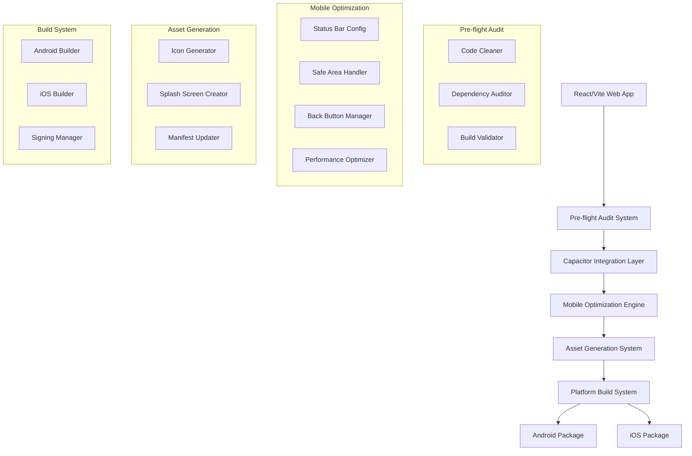

# Design Document

## Overview

This design outlines the architecture and implementation strategy for transforming the "PsikoOyun" React/Vite application into production-ready mobile applications for Android and iOS platforms using Capacitor. The system implements a comprehensive mobile DevOps pipeline that handles pre-flight checks, Capacitor integration, mobile-specific optimizations, and final packaging.

The current application is a PWA-enabled React application built with Vite, using modern libraries like Radix UI, TanStack Query, and Tailwind CSS. It features multiple psychology-themed games and is already configured with PWA capabilities, making it well-suited for mobile conversion.

## Architecture

### High-Level Architecture



### Component Architecture

The system is organized into distinct modules that handle different aspects of the mobile packaging pipeline:

1. **Audit Module**: Handles pre-flight checks and code optimization
2. **Integration Module**: Manages Capacitor setup and configuration
3. **Optimization Module**: Implements mobile-specific enhancements
4. **Asset Module**: Generates and manages mobile assets
5. **Build Module**: Handles platform-specific packaging
6. **Documentation Module**: Generates deployment instructions

## Components and Interfaces

### 1. Pre-flight Audit System

**Purpose**: Ensures the React application is production-ready before mobile packaging.

**Key Components**:
- `CodeCleaner`: Removes console.log statements, unused imports, and variables
- `DependencyAuditor`: Validates package versions and security
- `BuildValidator`: Ensures build process works correctly

**Interface**:
```typescript
interface AuditResult {
  codeCleanup: {
    consoleLogsRemoved: number;
    unusedImportsRemoved: number;
    unusedVariablesRemoved: number;
  };
  dependencies: {
    vulnerabilities: SecurityIssue[];
    outdatedPackages: Package[];
    recommendations: string[];
  };
  buildValidation: {
    success: boolean;
    outputPath: string;
    errors: string[];
  };
}
```

### 2. Capacitor Integration System

**Purpose**: Integrates Capacitor framework into the existing React project.

**Key Components**:
- `CapacitorInstaller`: Handles Capacitor package installation
- `ConfigurationManager`: Manages capacitor.config.ts setup
- `PlatformManager`: Adds Android and iOS platforms

**Configuration Structure**:
```typescript
interface CapacitorConfig {
  appId: string; // com.psikooyun.app
  appName: string; // PsikoOyun
  webDir: string; // dist
  server: {
    androidScheme: string;
    iosScheme: string;
  };
  plugins: {
    StatusBar: StatusBarConfig;
    SplashScreen: SplashScreenConfig;
    App: AppConfig;
  };
}
```

### 3. Mobile Optimization Engine

**Purpose**: Implements mobile-specific UI/UX optimizations and native behaviors.

**Key Components**:
- `StatusBarManager`: Configures status bar appearance
- `SafeAreaHandler`: Implements safe area constraints
- `BackButtonManager`: Handles Android back button behavior
- `PerformanceOptimizer`: Optimizes for mobile performance

**Mobile-Specific Enhancements**:
- CSS safe area variables implementation
- Android hardware back button handling
- Status bar styling to match app theme
- Touch-friendly UI adjustments
- Performance optimizations for mobile devices

### 4. Asset Generation System

**Purpose**: Creates all required mobile assets (icons, splash screens) in correct formats and sizes.

**Key Components**:
- `IconGenerator`: Creates app icons for all required sizes
- `SplashScreenGenerator`: Generates splash screens for all orientations
- `AssetOptimizer`: Optimizes assets for mobile platforms

**Asset Requirements**:
- Android: Various icon sizes (48dp to 512dp), adaptive icons
- iOS: Icon sizes from 20pt to 1024pt, launch images
- Splash screens for different screen densities and orientations

### 5. Platform Build System

**Purpose**: Handles the actual building and packaging of mobile applications.

**Key Components**:
- `AndroidBuilder`: Manages Android APK/AAB generation
- `iOSBuilder`: Handles iOS Xcode project preparation
- `SigningManager`: Manages app signing for distribution

**Build Outputs**:
- Android: Signed APK for testing, AAB for Play Store
- iOS: Xcode project ready for App Store submission

## Data Models

### Project Configuration
```typescript
interface ProjectConfig {
  name: string;
  packageId: string;
  version: string;
  buildPath: string;
  platforms: Platform[];
  assets: AssetConfig;
  signing: SigningConfig;
}

interface Platform {
  name: 'android' | 'ios';
  enabled: boolean;
  config: PlatformSpecificConfig;
}
```

### Asset Configuration
```typescript
interface AssetConfig {
  icon: {
    source: string;
    background: string;
    foreground?: string;
  };
  splashScreen: {
    source: string;
    backgroundColor: string;
    showSpinner: boolean;
  };
}
```

### Build Result
```typescript
interface BuildResult {
  platform: 'android' | 'ios';
  success: boolean;
  outputFiles: string[];
  errors: string[];
  warnings: string[];
  instructions: DeploymentInstructions;
}
```

## Error Handling

### Error Categories
1. **Pre-flight Errors**: Build failures, dependency issues, code problems
2. **Integration Errors**: Capacitor installation/configuration failures
3. **Asset Errors**: Icon/splash screen generation failures
4. **Build Errors**: Platform-specific compilation issues
5. **Signing Errors**: Certificate and signing problems

### Error Recovery Strategies
- Automatic retry for transient failures
- Fallback asset generation if custom assets fail
- Detailed error reporting with suggested fixes
- Rollback capabilities for failed integrations

### Error Reporting
```typescript
interface ErrorReport {
  category: ErrorCategory;
  severity: 'warning' | 'error' | 'critical';
  message: string;
  suggestedFix: string;
  documentation: string;
}
```

## Testing Strategy

### Unit Testing
- Test each module independently
- Mock external dependencies (npm, Capacitor CLI)
- Validate configuration generation
- Test asset generation algorithms

### Integration Testing
- Test complete pipeline from audit to build
- Validate Capacitor integration
- Test platform-specific builds
- Verify asset generation and placement

### End-to-End Testing
- Test complete mobile app packaging workflow
- Validate generated APK/AAB functionality
- Test iOS Xcode project compilation
- Verify app store submission readiness

### Testing Tools
- Jest for unit testing
- Playwright for E2E testing
- Android Emulator for Android testing
- iOS Simulator for iOS testing

### Test Scenarios
1. Clean project packaging
2. Project with existing Capacitor setup
3. Projects with build errors
4. Missing asset scenarios
5. Platform-specific configuration edge cases

## Mobile-Specific Considerations

### Android Optimizations
- Adaptive icon support
- Material Design compliance
- Hardware back button handling
- Android-specific permissions
- Play Store requirements compliance

### iOS Optimizations
- Human Interface Guidelines compliance
- Safe area handling for notched devices
- iOS-specific permissions
- App Store submission requirements
- Xcode project configuration

### Cross-Platform Considerations
- Consistent UI/UX across platforms
- Platform-specific asset optimization
- Performance optimization for mobile devices
- Offline functionality preservation
- PWA to native app transition