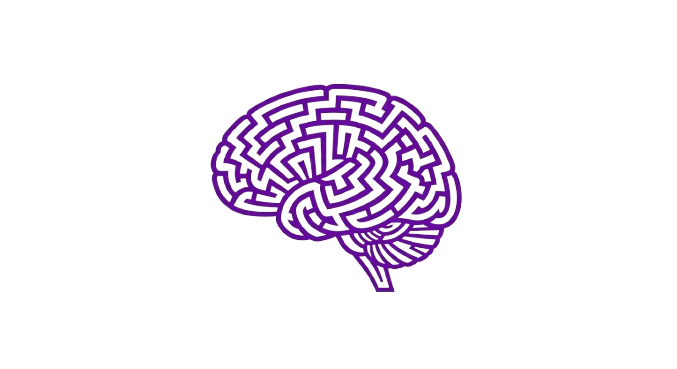

# PsikOyun 🧠🎮

**Psikoloji öğrencileri, psikologlar ve psikoloji ile ilgilenen herkes için özel olarak tasarlanan eğlenceli oyun koleksiyonu.**

PsikOyun, psikoloji alanındaki bilgileri eğlenceli bir şekilde öğrenmenizi ve test etmenizi sağlayan kapsamlı bir oyun platformudur. Grup halinde veya bireysel olarak oynayabileceğiniz çeşitli oyun modları ile psikoloji terimlerini, kavramları ve vakaları keşfedin.



## 🌟 Özellikler

### 🎯 6 Farklı Oyun Modu
- **🗣️ Psikoloji Tabu**: Psikoloji terimlerini anlatın, yasaklı kelimeler kullanmadan
- **🤔 Ben Kimim?**: Ünlü psikologları ve kavramları tahmin edin  
- **🎲 İki Doğru Bir Yalan**: Gerçek psikoloji bilgilerini yalanlardan ayırın
- **💡 Bil Bakalım**: Hızlı psikoloji soruları ile bilginizi test edin
- **🎨 Renk Dizisi**: Bellek ve konsantrasyon geliştirme oyunu
- **📚 Etik Problemler**: Gerçek vaka analizleri ile etik düşünme becerileri

###  Güçlü Veri Yönetimi
- **LocalStorage**: Tüm veriler güvenli şekilde cihazınızda saklanır
- **Oyun Geçmişi**: Skorlarınızı ve istatistiklerinizi takip edin
- **Takım Kayıtları**: Favori takımlarınızı kaydedin
- **Ayar Senkronizasyonu**: Tercihleriniz korunur

### 🎨 Tasarım ve UX
- **Modern Arayüz**: Temiz ve kullanıcı dostu tasarım
- **Akıcı Animasyonlar**: Smooth geçişler ve etkileşimler  
- **Erişilebilirlik**: Herkes için kullanılabilir
- **Performans**: Optimize edilmiş ve hızlı

## 🚀 Hedef Kitle ve Kullanım Alanları

### 👥 Kimler Kullanabilir?
- **Psikoloji Öğrencileri**: Ders çalışırken eğlenceli öğrenme deneyimi
- **Psikologlar**: Mesleki bilgileri test etme ve tazeleme
- **Akademisyenler**: Ders içi aktiviteler ve grup çalışmaları  
- **Psikoloji Meraklıları**: Genel kültür ve bilgi edinme
- **Öğretmenler**: Eğitici oyun etkinlikleri

### 🎯 Kullanım Senaryoları
- **Ders İçi Aktiviteler**: Sınıfta interaktif öğrenme
- **Grup Çalışmaları**: Takım halinde bilgi yarışması
- **Bireysel Pratik**: Kişisel gelişim ve öğrenme
- **Sosyal Etkinlikler**: Arkadaşlarla eğlenceli vakit geçirme
- **Sınav Hazırlığı**: Bilgileri pekiştirme ve test etme

## 🎮 Oyun Kılavuzu

### Tabu Oyunu
1. Takımları oluşturun (2-8 takım)
2. Oyun süresini ve hedef skoru ayarlayın
3. Psikoloji terimlerini anlatın, yasaklı kelimeleri kullanmayın
4. En yüksek skora ulaşan takım kazansın!

### Ben Kimim?
1. Oyuncu sayısını belirleyin
2. Ünlü psikologları ve kavramları tahmin edin
3. Doğru tahminlerle puan kazanın

### Diğer Oyunlar
Her oyunun kendine özgü kuralları ve zorluk seviyeleri vardır. Oyun içi rehberlerden yararlanın!

## 📊 Teknik Özellikler

### 🛠️ Teknoloji Stack
- **Frontend**: React 18 + TypeScript
- **Styling**: Tailwind CSS + Shadcn/ui
- **Build Tool**: Vite
- **PWA**: Web teknolojileri ile geliştirilmiş
- **State Management**: React Hooks
- **Storage**: LocalStorage API

### 🎯 Performance
- **Bundle Size**: Optimize edilmiş küçük boyut
- **Loading**: Lazy loading ve code splitting
- **Memory**: Verimli bellek kullanımı

### 📱 Platform Desteği
- ✅ Chrome/Chromium (Android, Desktop)
- ✅ Safari (iOS, macOS)
- ✅ Firefox (Android, Desktop)
- ✅ Edge (Windows, Android)

## 🔧 Geliştirme

### Kurulum
```bash
# Bağımlılıkları yükle
npm install

# Geliştirme sunucusunu başlat
npm run dev

# Production build
npm run build

# Build'i test et
npm run preview
```

### 📁 Proje Yapısı
```
src/
├── components/          # UI bileşenleri
│   ├── shared/         # Paylaşılan bileşenler
│   └── ui/             # shadcn/ui bileşenleri
├── games/              # Oyun motorları
│   ├── tabu/          # Tabu oyunu
│   ├── benkimim/      # Ben Kimim oyunu
│   └── ...            # Diğer oyunlar
├── hooks/              # Custom React hooks
├── lib/                # Yardımcı kütüphaneler
├── pages/              # Sayfa bileşenleri
├── types/              # TypeScript tipler
└── assets/             # Statik dosyalar
```

### 🎮 Yeni Oyun Ekleme
1. `src/games/` altında yeni klasör oluşturun
2. Oyun motorunu implement edin
3. UI bileşenlerini oluşturun
4. Ana menüye entegre edin
5. Storage sistemine kayıt özelliği ekleyin

## 📈 Veri Yönetimi

### Storage Sistemi
```typescript
// Oyun kaydı ekleme
saveGameRecord({
  id: Date.now().toString(),
  gameType: 'Tabu',
  gameDate: new Date().toISOString(),
  results: [/* takım skorları */],
  winner: 'Takım A'
});

// Geçmiş kayıtları okuma
const records = loadGameRecords();

// Ayarları kaydetme
saveSettings({
  darkMode: true,
  gameDuration: 90,
  // ...diğer ayarlar
});
```

### Veri Güvenliği
- ✅ LocalStorage otomatik yedekleme
- ✅ Hatalı veri kontrolü
- ✅ Quota limiti yönetimi
- ✅ Data validation
- ✅ Otomatik temizlik (100+ kayıt)

## 🎯 Önemli Özellikler

### Tema Sistemi
- Sistem ayarına göre otomatik tema
- Kullanıcı tercihini kaydetme
- Smooth geçişler

## 📝 Sürüm Notları

### v1.0.0 (Mevcut)
- ✅ 6 farklı oyun modu
- ✅ Modern web uygulaması
- ✅ Modern tema sistemi

### Gelecek Güncellemeler
- 🔄 Daha fazla oyun modu
- 🔄 Çevrimiçi çoklu oyuncu desteği
- 🔄 Başarı sistemi
- 🔄 İstatistik dashboard'u
- 🔄 Sosyal medya entegrasyonu

## 👥 Katkıda Bulunma

Bu proje açık kaynak olarak geliştirilmiştir. Katkılarınızı bekliyoruz!

### Nasıl Katkıda Bulunabilirim?
1. Projeyi fork edin
2. Feature branch oluşturun
3. Değişikliklerinizi yapın
4. Test edin
5. Pull request gönderin

## 📄 Lisans

Bu proje MIT lisansı altında lisanslanmıştır.

## 📞 İletişim

**Geliştirici**: Nadir Mermer  
**GitHub**: [Proje Deposu](https://github.com/Nadirmermer/oyun-arkadasi-91)

---

**PsikOyun ile Psikoloji Öğrenmeyi Eğlenceli Hale Getirin! 🧠✨**